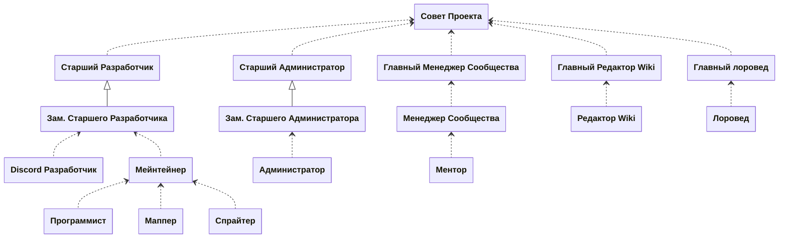

На этой странице описаны структура команды проекта, Совет Проекта и ключевые участники.

## Иерархия команды

Следующая диаграмма отражает иерархию команды и ее разделение на основные направления: разработка, администрация, работа с сообществом и Wiki.

## Совет Проекта

Совет проекта координирует основные направления и принимает решения, влияющие на развитие и стабильность проекта.

[Совет Проекта](/team/council)

## Направления

- [Разработчики](/team/dev)
- [Администрация](/team/admin)
- [Связь с Сообществом](/team/community)
- [Wiki](/team/wiki)
- [Лор](/team/lore)

## Текущие кандидатуры

- [Старший Разработчик](/team/dev#старший-разработчик)
  - Furior
- [Зам. Старшего Разработчика](/team/dev#заместитель-старшего-разработчика)
  - Maxiemar
- [Старший Администратор](/team/admin#старший-администратор)
  - VentelR
- [Зам. Старшего Администратора](/team/admin#заместитель-старшего-администратора)
  - Нет кандидатов
- [Главный Менеджер Сообщества](/team/community#главный-менеджер-сообщества)
  - Нет кандидатов
- [Главный Редактор Wiki](/team/wiki#главный-редактор-wiki)
  - Нет кандидатов
- [Главный лоровед](/team/lore#главный-лоровед)
  - Нет кандидатов
